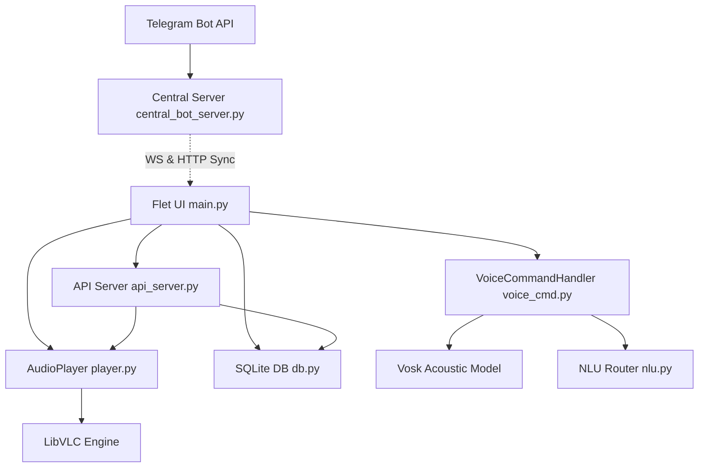

# Architecture

**Analysis Date:** 2026-05-18

## Pattern Overview

**Overall:** Thread-Safe Modular Desktop Player with Background Sync Server and REST API.

**Key Characteristics:**
- **Concurrent Async Loops:** Runs Flet GUI, local FastAPI server, and Telegram Bot (via background polling) in parallel, requiring extreme care with event loops.
- **LibVLC Audio Abstraction:** Dynamic player bindings for media playback, device switching, and real-time equalizer manipulation.
- **Local SQLite Persistence:** Synchronous database sessions with context safety wrappers.
- **Microphone Sound Device Watcher:** Asynchronous thread pool listener for STT (Speech-to-Text) intent matching.

---

## Layers

### 1. Presentation Layer (Flet UI)
- **Purpose:** Renders the application window, handles window scaling, manages playlists, processes theme coloring, and triggers playback changes.
- **Location:** [main.py](file:///Users/apfanom/audaci-apt/main.py) (Main Application Shell), `ui/karaoke.py` (Karaoke view), `ui/playlist_menu.py`.
- **Concurrency:** Launches the local API server and watchdog filesystem observers inside separate daemon threads to prevent UI stutters.

### 2. Audio Engine Layer (VLC wrapper)
- **Purpose:** Interfaces directly with VLC bindings to load, play, pause, and seek tracks. Controls audio normalization, custom 10-band equalizers, and dynamic hardware output channel switching.
- **Location:** [core/player.py](file:///Users/apfanom/audaci-apt/core/player.py).
- **Used by:** Presentation layer (`main.py`) and Web API (`api_server.py`).

### 3. Data & Persistence Layer
- **Purpose:** Runs SQL queries to add tracks, retrieve custom play histories, generate smart playlists ("smart waves"), and search files.
- **Location:** [core/db.py](file:///Users/apfanom/audaci-apt/core/db.py).
- **Safety:** Utilizes a custom `@contextmanager` `db_session()` which wraps database tasks, handles rollbacks on exceptions, and closes connections to avoid memory leaks.

### 4. Metadata, Tag, and Lyrics Fetcher
- **Purpose:** Extracts Mutagen tags from local audio files, embeds covers from Telegram uploads, queries Last.fm for track vibes, and downloads scrolling LRC lyrics from LRCLIB.
- **Location:** [core/metadata_handler.py](file:///Users/apfanom/audaci-apt/core/metadata_handler.py), [core/tag_fetcher.py](file:///Users/apfanom/audaci-apt/core/tag_fetcher.py), [core/lyrics_handler.py](file:///Users/apfanom/audaci-apt/core/lyrics_handler.py).

### 5. Voice & NLU Control Layer
- **Purpose:** Captures microphoned input streams via `sounddevice` at 16kHz, performs offline StT using Vosk Kaldi neural engines, and resolves intent parameters (e.g. play next, play specific artist) phonetic-safely.
- **Location:** [core/voice_cmd.py](file:///Users/apfanom/audaci-apt/core/voice_cmd.py) and [core/nlu.py](file:///Users/apfanom/audaci-apt/core/nlu.py).

### 6. Streaming & Control REST Server
- **Purpose:** Exposes player API endpoints to allow remote controls and securely streams authorized media directories while preventing Path Traversal / Local File Inclusion (LFI).
- **Location:** [core/api_server.py](file:///Users/apfanom/audaci-apt/core/api_server.py) and [central_bot_server.py](file:///Users/apfanom/audaci-apt/central_bot_server.py).

---

## Data Flow

### 1. Telegram Track Sync Flow
1. User uploads a track (e.g. `Awesome.mp3`) to the Telegram Bot.
2. [central_bot_server.py](file:///Users/apfanom/audaci-apt/central_bot_server.py) downloads it, parses/embeds thumbnail tags, and appends it to the sync queue database.
3. The server notifies the connected desktop client through the active WebSocket channel (`{"event": "new_track"}`).
4. The client's background receiver in [main.py](file:///Users/apfanom/audaci-apt/main.py) downloads the track from `/api/sync/{code}/download`, saves it inside the user's local `Music/Audaci Telegram` directory, parses its metadata, updates the UI, and issues a system notification.

### 2. Spoken Voice Command flow
1. User says "Астра, сделай погромче" (Astra, make it louder) into the mic.
2. `VoiceController` in [core/voice_cmd.py](file:///Users/apfanom/audaci-apt/core/voice_cmd.py) captures sound bytes and pipes them to Vosk's `KaldiRecognizer`.
3. Speech is converted to text: `"астра сделай погромче"`.
4. `VoiceCommandHandler` verifies the wake word (`"астра"`), strips it, and matches the remaining phrase against `COMMANDS`.
5. The handler invokes the registered callback (`louder`), which executes `player.set_volume(new_volume)`.

---

## State Management

- **Client AppState:** Encapsulated in the `AppState` class inside [main.py](file:///Users/apfanom/audaci-apt/main.py), storing current play status, tracks queue, selected playlists, volume levels, and sync setups.
- **Thread Safety:** The web server communicates with Flet's frontend through a thread-safe control callback registered during startup, keeping operations insulated across standard python threads.

---

*Architecture analysis: 2026-05-18*
*Update when major patterns change*
