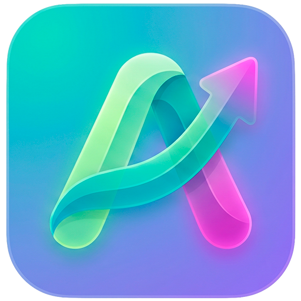
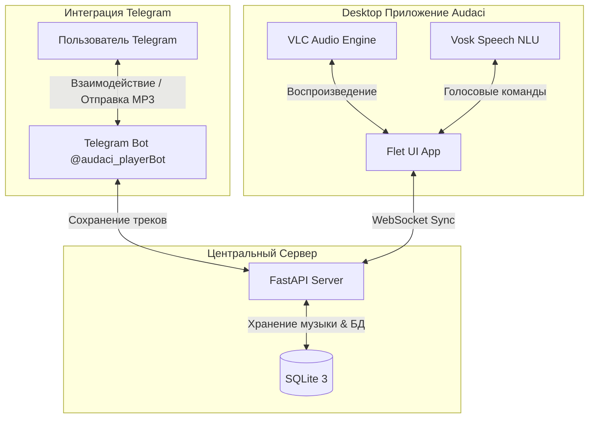

# Audaci 

<p align="center">
  
  <br>
  <i>Современный оффлайн-плеер с голосовым управлением, веб-API и интеграцией с Telegram</i>
</p>

---

**Audaci** — это современный кроссплатформенный музыкальный плеер с открытым исходным кодом, построенный на базе фреймворка **Flet** (Flutter + Python). Приложение объединяет локальное воспроизведение музыки, оффлайн-распознавание голосовых команд, удаленное управление через Web-API и бесшовную синхронизацию музыкальной библиотеки через Telegram-бота.

---

## ✨ Основные возможности

* 🎙️ **Голосовое управление:** Полностью локальное (без отправки данных в облако) распознавание команд (пауза, следующий трек, поиск) благодаря встроенной модели **Vosk API**.
* 📲 **Telegram Sync:** Отправляйте любимые треки в Telegram-бот плеера. Они автоматически загрузятся в вашу библиотеку и синхронизируются по уникальному QR-коду / коду авторизации.
* 🌐 **Remote Web-API & WebSockets**: Встроенный FastAPI-сервер позволяет удаленно опрашивать состояние плеера, транслировать информацию "Now Playing", управлять громкостью и переключать плейлисты в реальном времени.
* 🧠 **Умные плейлисты (Vibe DJ):** Автоматическое тегирование и группировка треков по настроению (Chill, Energetic, Sad, Happy) на основе метаданных с помощью библиотеки **Mutagen**.
* 🎨 **Интуитивный интерфейс:** Современный дизайн на Flet с возможностью плавной смены тем оформления (светлая/темная) и сохранением ваших настроек.
* 📦 **Полностью Portable сборки:** Выпуски для Windows и macOS содержат встроенный движок **VLC (libvlc)** и PortAudio, что позволяет запускать приложение на абсолютно «чистых» компьютерах без ручной установки сторонних плееров.

---

## 📐 Архитектура взаимодействия



---

## 🛠 Технологический стек

* **UI & Presentation:** [Flet](https://flet.dev/) (Flutter-инфраструктура на Python)
* **Аудиодвижок:** Python-VLC (интеграция с VLC media player API), Mutagen (парсинг метаданных и обложек)
* **Голосовой движок:** Vosk API & PyAudio (локальное NLU распознавание)
* **Web / API:** FastAPI, Uvicorn, WebSockets (синхронизация состояния и удаленный контроль)
* **Интеграция:** Aiogram 3.x (асинхронное взаимодействие с Telegram Bot API)
* **База данных:** SQLite 3

---

## 🚀 Быстрый старт (Разработка)

### 1. Подготовка окружения
```bash
# Клонируйте репозиторий
git clone https://github.com/Aphanom/audaci-apt.git
cd audaci-apt

# Создайте и активируйте виртуальное окружение
python3 -m venv venv
source venv/bin/activate  # Для Linux/macOS
# .\venv\Scripts\activate  # Для Windows

# Установите зависимости
pip install --upgrade pip
pip install -r requirements.txt
```

### 2. Установка языковой модели Vosk
Для работы голосового управления скачайте легковесную модель Vosk для русского языка (например, [vosk-model-small-ru-0.22](https://alphacephei.com/vosk/models)).
Распакуйте архив в корень репозитория и переименуйте папку в `model` (так, чтобы файл `model/am/final.mdl` был доступен).

### 3. Конфигурация секретов
Создайте файл `.env` в корне проекта (он автоматически игнорируется Git):
```env
TELEGRAM_TOKEN=your_bot_token_here
```

### 4. Запуск компонентов

* **Запуск Desktop-приложения плеера**:
  ```bash
  python main.py
  ```

* **Запуск сервера синхронизации и Telegram-бота**:
  ```bash
  python central_bot_server.py
  ```

---

## 📦 Сборка и Релизы (CI/CD)

В репозитории настроен автоматизированный CI/CD пайплайн на базе **GitHub Actions** (`build.yml`), собирающий готовые дистрибутивы под ключевые ОС:

### 🪟 Windows (.exe)
Собирается с помощью `flet build windows`. В процессе сборки пайплайн автоматически скачивает портативную сборку VLC, внедряет динамические библиотеки `libvlc.dll`, `libvlccore.dll` и плагины в директорию `vlc/` исполняемого файла. Наше приложение автоматически подхватывает их при старте.

### 🍎 macOS (.app)
Собирается под целевую архитектуру (Intel/Apple Silicon). Пайплайн скачивает дистрибутив VLC `.dmg`, монтирует его, переносит динамические библиотеки во внутреннюю структуру приложения `Contents/MacOS/vlc/` и перелинковывает их пути с помощью `delocate-path`.

### 🐧 Linux (.deb)
Упаковывает приложение в Debian-пакет с указанием необходимых системных зависимостей (`Depends: libgtk-3-0, libvlc5, vlc, portaudio19`), которые автоматически доустанавливаются пакетным менеджером при развертывании.

---

## 📂 Структура проекта

* `core/` — Ядро приложения:
  * `player.py` — Управление VLC-плеером и динамическая настройка путей к библиотекам движка.
  * `db.py` — Слой хранения (библиотека треков, история воспроизведения, плейлисты).
  * `nlu.py` — Обработка голосовых команд и Vosk-распознавание.
  * `api_server.py` — Конечные точки FastAPI для удаленного управления.
  * `telegram_handler.py` — Логика Telegram-бота для загрузки музыки.
* `ui/` — Разметка и компоненты Flet-интерфейса.
* `assets/` — Статические изображения, иконки и шрифты.
* `tests/` — Модульные и интеграционные тесты (написаны на Pytest).
* `central_bot_server.py` — Точка входа для запуска асинхронного Telegram-бота и сервера синхронизации.
* `main.py` — Главная точка входа для Desktop-клиента.

---

## 🤝 Обратная связь и контакты

Разработчик: **Vlad (Aphanom)**
